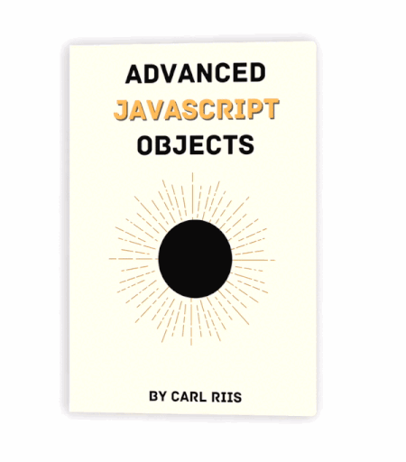

<h1 align="center">Advanced JavaScript Objects</h1>

An e-book entirely about JavaScript objects

		

## Chapters

Total length: 70 A4 pages.

- **[Chapter 0](./chapters/chapter-0.md) - Introduction**
- **[Chapter 1](./chapters/chapter-1.md) - Getting Our Data Structures Straight**
- **[Chapter 2](./chapters/chapter-2.md) - Object Basics**
- **[Chapter 3](./chapters/chapter-3.md) - Property Descriptors and Object Restrictions**
- **[Chapter 4](./chapters/chapter-4.md) - Internal Object Behavior**
- **[Chapter 5](./chapters/chapter-5.md) - Prototypes**
- **[Chapter 6](./chapters/chapter-6.md) - this**
- **[Chapter 7](./chapters/chapter-7.md) - Constructors**
- **[Chapter 8](./chapters/chapter-8.md) - Classes**
- **[Appendix A](./chapters/appendix-a.md) - Well-known Symbols**
- **[Appendix B](./chapters/appendix-b.md) - Strict Mode**
- **[Appendix C](./chapters/appendix-c.md) - receiver argument for traps**

## YouTube video about arrays

Inspired by this book, I created a YouTube video where I cover the quirks of JavaScript arrays. I also show you *how* I learned it by going over the ECMAScript specification. Watch it by clicking the image below.

## Other resources

If you're looking for other resources on JavaScript, here's what I recommend:

- [javascript.info](https://javascript.info/) - A broad resource for beginners.
- [You Don't know JS](https://github.com/getify/You-Dont-Know-JS) - A book series covering subjects in depth for beginners.
- [2ality.com](https://2ality.com/) - Books and blog posts for both beginners and specification enthusiasts.
- [Understanding ECMAScript 6](https://leanpub.com/understandinges6/read) - A book written when ES6 came out describing its features.
- [The ECMAScript specification](https://tc39.es/ecma262/#sec-intro) - Described in [Chapter 0](./chapters/chapter-0.md).

## License

This project is licensed under the MIT License - see the [LICENSE](LICENSE) file for details.
All images were created by me. Feel free to steal them (same goes for everything else of course).
