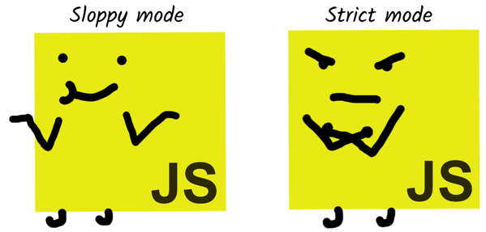

# Appendix B: Strict Mode

Strict mode in is something you can enable in your JavaScript code. Running your code in strict mode will result in a slightly different interpretation of the language. Strict mode is described as a more "modern version" of JavaScript that is less prone to errors.

Not running your code in strict mode is sometimes referred to as "Sloppy mode".



## When is my code running in strict mode?

One way is to put a `“use strict”` statement at the top of a file.

```jsx
"use strict"

console.log("This is running in strict mode!")
```

It can also be enabled for an individual function.

```jsx
function func() {
	"use strict"
	console.log("This is running in strict mode!")
}
```

Strict mode is also auto-enabled for all [ES modules](https://hacks.mozilla.org/2018/03/es-modules-a-cartoon-deep-dive/). You are using ES modules if you use the import/export keywords.

```jsx
import {} from "./example"

console.log("This is running in strict mode!")

export {}
```

## Example of difference

An example can be found in [chapter 6 "Traditional function on its own"](./chapter-6.md#traditional-function-on-its-own).


