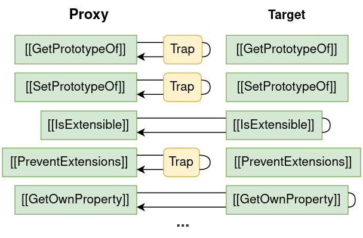

# Chapter 4 - Internal Object behavior


Peeking into the internals of objects can be a good way to understand how they work. One useful concept to understand is *internal methods*. This chapter covers the different internal methods of different objects, and how they behave. It also covers how knowledge about these internal methods can be used in your JavaScript programs.

## Internal methods basics

Every JavaScript object has internal methods, although some have more than others. These methods get called when you have pretty much any interaction with objects. The names of internal methods are labelled by enclosing brackets ([ ]), e.g. [[HasProperty]]. This is to distinguish them from regular object methods.

You can’t actually call an internal method in your JavaScript program. This is because they exist outside the execution context of your code. They are called by your JavaScript *engine*, not your code. Still, it’s helpful to understand *when* they are called by the engine.

## Essential internal methods

Some internal methods exist on every single object. These are called *essential internal methods*. 

Below is a table with all essential internal methods. The arguments and return types are written with a notation that resembles an arrow function. An arrow (`=>`) separates the arguments from the return type. The pipe symbol (`|`) is used when a value can be multiple possible types. Square brackets (`[]`) after a type means an array of that type.

| Internal Method | Arguments- and return type | Description |
| --- | --- | --- |
| [[GetPrototypeOf]] | () => Object \| Null | Get the prototype of the object. |
| [[SetPrototypeOf]] | (Object \| Null) => Boolean | Change the prototype of the object. |
| [[IsExtensible]] | () => Boolean | Check if the object is extensible. |
| [[PreventExtensions]] | () => Boolean | Make the object non-extensible. |
| [[GetOwnProperty]] | (Key) => Descriptor | Undefined | Get the descriptor of a property. |
| [[DefineOwnProperty]] | (Key, Descriptor) => Boolean | Define a property with a descriptor. |
| [[HasProperty]] | (Key) => Boolean | Check if a property exists. |
| [[Get]] | (Key, Receiver) => Any | Get the value of a property. |
| [[Set]] | (Key, Any, Receiver) => Boolean | Change the value of a property. |
| [[Delete]] | (Key) => Boolean | Delete/remove a property. |
| [[OwnPropertyKeys]] | () => Key[] | Get all property keys. |

As you can see, some types are different than the ones we defined in chapter one. This is because they are internal and separate from the language types you use in your code. All of the internal types can be converted into language types and vise versa. The new internal types introduced above are:

- `Key`. A property key. Is converted to/from a String or Symbol.
- `Any`. Can be any language type. All instances of this type above represent property values.
- `Descriptor`. The descriptor of a property. Is converted to/from an Object.
- `Receiver`. This argument is always optional. If specified, it will become the `this` of the function. If not, `this` will be the object the method is called on. It will be covered more later.

## Internal methods of functions

As you know already, functions are objects. But functions also have extra internal functionality. Specifically, they have an extra internal method called [[Call]].
The [[Call]] method is executed internally when the function is called in your code.

| Internal method | Arguments- and return type |
| --- | --- |
| [[Call]] | (Any, Any[]) => Any |

## Internal methods of constructors

Constructors are functions which have have a [[Construct]] internal method in addition to their [[Call]] method. They will be covered much more in [Chapter 7](./chapter-7.md).

| Internal method | Arguments- and return type |
| --- | --- |
| [[Construct]] | (Any[], Object) => Object |

## Reflect: The internal method wrapper

As mentioned before, you can’t call internal methods because, well, they’re internal. But you can sort of call them with the help of `Reflect`.

`Reflect` provides minimal wrappers over the internal methods. Meaning, we can call the internal methods *through* `Reflect`. This effectively bridges the gab between the internal methods and our code.

You will notice that `Reflect` has a lot of similar methods as `Object`. `Object` is more utility focused and doesn’t cover all the internal methods. It also, unlike `Reflect`, has methods than don’t correspond directly with internal methods.

Below, you will see a table with all the internal methods and their corresponding `Reflect` method. The `Object` method is also listed if it exists.

| Internal method | Reflect method | Object method |
| --- | --- | --- |
| [[GetPrototypeOf]] | `Reflect.getPrototypeOf` | `Object.getPrototypeOf` |
| [[SetPrototypeOf]] | `Reflect.setPrototypeOf` | `Object.setPrototypeOf` |
| [[IsExtensible]] | `Reflect.isExtensible` | `Object.isExtensible` |
| [[PreventExtensions]] | `Reflect.preventExtensions` | `Object.preventExtensions` |
| [[GetOwnProperty]] | `Reflect.getOwnPropertyDescriptor` | `Object.getOwnPropertyDescriptor` |
| [[DefineOwnProperty]] | `Reflect.defineProperty` | `Object.defineProperty` |
| [[HasProperty]] | `Reflect.has` |  |
| [[Get]] | `Reflect.get` |  |
| [[Set]] | `Reflect.set` |  |
| [[Delete]] | `Reflect.deleteProperty` |  |
| [[OwnPropertyKeys]] | `Reflect.ownKeys` |  |
| [[Call]] | `Reflect.apply` |  |
| [[Construct]] | `Reflect.construct` |  |

All of the `Reflect` methods take in an object as their first argument. This is the object that the internal method should be called on. The other arguments will match the ones the internal method has. An example is the internal method [[HasProperty]] which takes in a single `Key` argument. The corresponding `Reflect.has` method takes in *two* arguments. The first one being the object that the [[HasProperty]] should be called on. The second argument being the actual argument to [[HasProperty]].

```jsx
const obj = { a: "A" }
console.log(Reflect.has(obj, "a")) // true
```

## Ordinary objects vs exotic objects

In JavaScript, not all objects are created equal. Most objects are what’s called *Ordinary Objects*. These include the ones you create yourself. Other Objects are what’s called *exotic objects*. Exotic objects have different internal behavior than ordinary Objects. Specifically, they have a different implementation of some of their internal methods. This allows them to have special internal functionality that isn’t available to ordinary objects.

Here are all the exotic objects:

- Bound function objects
- Array objects
- String (primitive wrapper) objects
- Argument objects
- Integer-indexed objects
- Module namespace objects
- Immutable prototype objects
- Proxy objects

Two of these will be explained further below; array- and proxy objects.

### Arrays (exotic Objects)

Arrays are exotic objects that have a different [[DefineOwnProperty]] method than ordinary objects. The [[DefineOwnProperty]] method is used internally to define properties. For ordinary objects this method is quite straight forward; a property is defined with a key, value, and descriptor. The [[DefineOwnProperty]] of arrays works the same but has special behavior for properties in two special cases:

- Case 1: The key is called `“length”`
- Case 2: The key is a valid array index. To be this, the key needs to fulfill two criteria:
    1. It should be a *numeric* string. Meaning, a string that is a valid number e.g. `“5”`
    2. The numeric value is a positive number e.g. `“10”` not `“-10”`.
 
>💡 The property values of an array object are also refereed to as array *elements.*
>

>💡 It might sound strange to learn that valid array indexes has to be a strings. This is because we normally use numbers to access/define array elements. It might be helpful to think of two different kinds of array indexes:
> - Internal array indexes which has to be strings.
> - External array indexes which can be both strings and numbers.
> The reason external array indexes can be both strings and numbers, is that numbers are converted to strings if used as property keys.
> 

#### Special case 1: The key is called “length”

It is possible to redefine the `length` property on your arrays. In this case, the internal method will “cut off” extra elements that would make the array exceed the new length.

```jsx
const arr = ["a", "b", "c"]
arr.length = 2

console.log(arr) // ["a", "b"]
```

In the above example, the last element `“c”` was removed from the Array. 
If you set `length` to be greater than the current length then no elements will be removed. This does create a bit of a strange case, however. In that case, the number of array elements won’t match the length of the array. Turns out this is perfectly valid.

```jsx
const arr = ["a", "b", "c"]
arr.length = 5

console.log(arr) // [ "a", "b", "c", <2 empty items> ]
```

Your browser might explain the difference between the number of elements and the length with `<x empty items>`. Don’t be fooled by that. These “empty items” don’t actually exist.

#### Special case 2: The key is a valid array index

If you define a property with a valid array index key, JavaScript will convert the key to a number and compare it to the value of its `length` property.
If the numeric value of the key is greater then or equal to (`>=`) the value of `length`, it will redefine `length`. The value of `length` will be set to the numeric value of the key `+ 1`.

```jsx
const arr = ["a", "b"]
console.log(arr.length) // 2

arr["2"] = "c"
console.log(arr.length) // 3
```

In the above example, we start be defining an array with a length of 2. We then define a property using the key `“2”`. The length changes to the numeric value of `“2”` plus one (`2 + 1 = 3`).

The length will also be re-defined if the numeric value is greater than the length. We can see this below where we define a property using the key `“5”` on an array with a length of 2. The length changes to `5 + 1 = 6`.

```jsx
const arr = ["a", "b"]
console.log(arr.length) // 2

arr["5"] = "c"
console.log(arr.length) // 6
```

The length is now 6 but the amount of elements is still 3. Because of this, your browser will likely show some “empty items” inside the array. Remember, these aren’t real elements.

```jsx
console.log(arr) // [ "a", "b", <3 empty items>, "c" ]
```

#### Normal property assignment

If a property is assigned to the array object that doesn’t fit the two special cases, it will be assigned normally. This won’t affect the length of the array.

```jsx
const arr = ["a", "b", "c"]
arr["Hello"] = "World"

console.log(arr) // [ "a", "b", "c", Hello: "World" ]
console.log(arr.length) // 3
```

### Proxies (exotic objects)

Proxies are the only exotic objects that have a different implementation of every single essential internal method. When one of its internal methods are called, the proxy can call a function of *your* choosing. You can essentially set up listeners that run custom code when internal methods are called. This is really powerful and allows you to create truly flexible objects.

#### Proxy handlers

When you initialize a proxy you give it a *proxy handler,* which is an object. You attach methods to this object which will be called by the proxy. A method on a proxy handler is called a *trap*. A trap is specific to a certain internal method.

Below you will see a proxy handler that implements every possible trap. This is not required. You only need to define the traps you need. The traps have a comment indicating which type should be returned from them.

```jsx
const proxyHandler = {
  getPrototypeOf: (target) => {}, // Object | Null
  setPrototypeOf: (target, proto) => {}, // Boolean
  isExtensible: (target) => {}, // Boolean
  preventExtensions: (target) => {}, // Boolean
  getOwnPropertyDescriptor: (target, key) => {}, // Object
  defineProperty: (target, key, desc) => {}, // Boolean
  has: (target, key) => {}, // Boolean
  get: (target, key, receiver) => {}, // Any
  set: (target, key, value, receiver) => {}, // Boolean
  deleteProperty: (target, key) => {}, // Boolean
  ownKeys: (target) => {}, // (String | Symbol)[]
  apply: (target, thisArg, args) => {}, // Any
  construct: (target, args, newTarget) => {} // Object
}
```

#### Trap name

The name of the trap is the same as the internal method’s corresponding `Reflect` method. An example could be the internal method [[HasProperty]], which has a corresponding `Reflect` method called `has`. This means that the trap for [[HasProperty]] is also called `has`.

#### Trap arguments

The arguments passed to a trap will also match the arguments passed to the corresponding `Reflect` method. The `Reflect.has` method takes in two arguments, `target` and `key`. This means that the trap called `has` will also receive the arguments `target` and `key`.

#### Trap return type

The expected return type of a trap will also match that of the corresponding `Reflect` method. The `Reflect.has` method returns a Boolean, which means the trap called `has` should also return a Boolean.

#### Proxy targets

Initializing a proxy also requires another Object called the *target*. This will serve as a fallback. If an internal method isn’t implemented in your proxy handler, it will call the internal method on the target instead. The target is also passed to every trap as the first argument.

The below diagram shows a proxy that has traps for 3 internal methods. 



### Creating Proxies

You create a new proxy object with the globally available `Proxy` constructor. The first argument is the target and the second is the proxy handler.

```jsx
const proxyObj = new Proxy(target, proxyHandler)
```

The result is an exotic proxy object which will call your traps when its own internal methods are called. A few useful internal methods to trap are covered below.

#### Trapping [[Get]]

This will call your trap for every attempt to access property values on your Object. The value that you return from your trap will act as the property value. The below Proxy object will return a custom string for every property value requested.

```jsx
const proxyObj = new Proxy({}, {
    get: (target, key, receiver) => {
      return `Value for key ${key}`
    }
  }
)

console.log(proxyObj.key123) // Value for key key123
console.log(proxyObj.helloWorld) // Value for key helloWorld
```

> ⚠️ It still is possible to circumvent this trap by getting the whole descriptor of a property. The descriptor will contain the value or a getter function. Of course, you could trap [[GetOwnProperty]] to prevent this.
>

#### Trapping [[Set]]

This will call your trap every time an attempt is made to assign a value to a property.  

```jsx
const proxyObj = new Proxy({}, {
    set: (target, key, value, receiver) => {
      console.log("You want to set", value, "on", key)
      return true
    }
  }
)

proxyObj.abc = 1 // You want to set 1 on abc
proxyObj.dfg = 2 // You want to set 2 on dfg
```

It’s important to return `true` from this trap. Otherwise, the assignment will be considered failed and a `TypeError` will be thrown in Strict-mode.

> ⚠️ Your [[Set]] trap won’t trigger if a property is defined with a descriptor. Although, it is possible to trap [[DefineOwnProperty]] which will catch that.
>

#### receiver in [[Get]] and [[Set]] traps

You may have noticed how the [[Get]] and [[Set]] traps take in an argument called `receiver`. It could be important in certain cases. You can read about it in [Appendix B](./appendix-b.md). I recommend that you finish [chapter 5](./chapter-5.md) first.

#### Trapping [[OwnPropertyKeys]]

This allows you to return a custom set of property keys for the object.

```jsx
const proxyObj = new Proxy({}, {
    ownKeys: (target) => ["a", "b", "c"]
  }
)

console.log(Reflect.ownKeys(proxyObj)) // ["a", "b", "c"]
console.log(Object.keys(proxyObj)) // []
```

As you can see, `Reflect.ownKeys` return the keys from our trap but `Object.keys` does not. The reason for this, is that `Object.keys` only returns keys of enumerable properties. The keys we return from our proxy trap don’t actually exist, meaning they don’t have a descriptor with an `enumerable` attribute.

#### Trapping [[GetOwnPropertyDescriptor]]

This will allow you to return custom descriptors for any call to [[GetOwnPropertyDescriptor]]. Using this, we can fix the example above by always returning a descriptor specifying that the property is enumerable.

```jsx
const proxyObj = new Proxy({}, {
    ownKeys: (target) => ["a", "b", "c"],
    getOwnPropertyDescriptor: (target, key) => {
      return { enumerable: true, configurable: true }
    }
  }
)

console.log(Object.keys(proxyObj)) // ["a", "b", "c"]
```

This will also allow our “fake” property keys to be used with the spread operator (`{...obj}`) and the for..in loop.

> ⚠️ For the descriptor returned, it is required to have the `configurable` attribute set to `true` unless the target explicitly has `configurable` set to `false` for the same property. Don't worry too much about why. This is just a quirk of proxies.
> 

#### Trap ideas

The traps showed so far have been pretty simple. Here are some more interesting ideas for traps. There are code examples for these in appendix X.

- Validate data
- Restricting access to certain properties
- Limit property values to be a certain type
- Listen and change something like DOM
- Just logging. Using Reflect.
