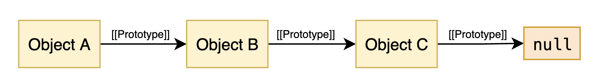

# Chapter 5 - Prototypes

Have you ever thought about how you are able to call `.toString` on seemingly every object? 

```js
const obj = {}
console.log(Reflect.ownKeys(obj)) // []

console.log(obj.toString()) // [object Object]
```

How is this possible if the object doesn’t have any properties? The answer is *prototypes.* Prototypes is how you implement inheritance in JavaScript. They allow you have an object inherit properties from another object. Our empty object inherited the `.toString` method from a standard object called `Object.prototype`.

```js
const obj = {}
console.log(obj.toString === Object.prototype.toString) // true
```

## The Prototype chain

All objects have an internal property called [[Prototype]]. The value of this property is either `null` or a reference to another object. The value of this internal property is refereed to as the *prototype* of the object. You can’t directly access it but you can retrieve it using `Object.getPrototypeOf` or `Reflect.getPrototypeOf`.

```js
const obj = {}
const objProto = Reflect.getPrototypeOf(obj)
console.log(typeof objProto) // object
```

In the above example, we define an empty object literal. We then use `Reflect.getPrototypeOf` which gives us the prototype of that object. As we can see, the prototype of our object is also an object. This might seem a bit strange; we never gave `obj` a prototype. Object literals have a default prototype. More on that later. 

We now know that objects can have an internal reference to another object known as their prototype. This becomes more interesting when you realize that since prototypes are also objects, prototypes can have their *own* prototype. This leads to something called the *prototype chain.* It’s the linking between potentially multiple objects through prototypes.



Above, we can see a prototype chain starting with Object A. Object A has the prototype Object B. Object B has the prototype Object C. A prototype chain ends if the prototype of an object is `null`. This is the case for Object C.


>💡 It’s important to take note of the direction of the arrows. The prototype of Object A is Object B, but not vice versa. Object B knows nothing about Object A. Object A is not part of the prototype chain of Object B.
>

### Inheritance

The prototype chain isn’t just used to link objects together, it’s used for inheritance. Specifically, if an object lacks a property, it can inherit it from its prototype chain. To understand how this works, it’s important to understand what happens when you try to access a property. It goes as follows[^get]:

1. If the property exists on the object, **return** it.
2. Else, retrieve the object’s prototype. If that’s `null` **return** `undefined`.
3. Else, go back to step 1. This time let the “object” be the prototype.

This means your JavaScript engine will “clime up” the prototype chain in search of the property. If it doesn’t exist on the object it will check the prototype, then that prototype’s prototype etc. until it finds it or reaches `null`. 

Consider these three objects. They each have a unique property. How many of these properties are accessible to Object A?


The answer is all of them. Property X exists directly on Object A and Property Y and Z exist in its prototype chain.

What if the same property key exists multiple places in a prototype chain? Which property value will be returned when Property X is accessed on Object A below?


The answer is Property X of Object B. It comes first in the prototype chain. When the JavaScript engine goes through the prototype chain to find a property, it stops when it finds the first occurrence.

>💡 Properties that exist directly on an object are refereed to as its *own* properties. This term is used in methods like `Reflect.getOwnPropertyDescriptor` and `Reflect.ownKeys`. These functions won’t clime up the prototype chain.
>

## Standard prototypes

Some objects are used as the default prototype for the objects you create. It’s useful to understand these so you know which properties your objects inherit. Two important standard prototypes will be covered below.

#### Object.prototype

If you create an object literal, the prototype will be an object called `Object.prototype`. It isn’t just specific to object literals however. It is no doubt the most important object in the context of prototypes. It is present in the prototype chain of practically every object in JavaScript. It’s usually found at the end of the chain right before `null`.

For object literals, it’s the first and only prototype.

Below, the properties of `Object.prototype` are logged.

```js
const obj = {}
const proto = Reflect.getPrototypeOf(obj)
console.log(proto === Object.prototype) // true
console.log(Reflect.ownKeys(proto))
/* [
  'constructor',
  '__defineGetter__',
  '__defineSetter__',
  'hasOwnProperty',
  '__lookupGetter__',
  '__lookupSetter__',
  'isPrototypeOf',
  'propertyIsEnumerable',
  'toString',
  'valueOf',
  '__proto__',
  'toLocaleString'
] */
```

#### Function.prototype

The prototype of the functions you create will be `Function.prototype`. It contains useful methods like `apply`, `bind`, and `call` which will be covered later in [Chapter 6](./chapter-6.md#traditional-function-using-bind-call-or-apply).

```js
function func() {}
const proto = Reflect.getPrototypeOf(func)
console.log(proto === Function.prototype) // true
console.log(Reflect.ownKeys(proto))
/* [
  'length',
  'name',
  'arguments',
  'caller',
  'constructor',
  'apply',
  'bind',
  'call',
  'toString',
  Symbol(Symbol.hasInstance)
] */
```

The prototype of `Function.prototype` is `Object.prototype`. Notice how both Objects contain a `.toString` method. This means that functions don’t access the `.toString` from `Object.prototype`, but instead access a more function specific `.toString` method from `Function.prototype`.


## The .\_\_proto\_\_ property

If you open your browser console and access a property called `__proto__` on an object, you will receive its prototype. 

```js
const obj = {}
const objProto = Reflect.getPrototypeOf(obj)
console.log(objProto === obj.__proto__) // true
```

Because of this, many people assume that the prototype of an object is stored *on* the `.__proto__` property. This is wrong. The prototype of an object is stored internally, and `.__proto__` is just an accessor property that exposes it.

It is not recommended that you use `.__proto__` to access or set prototypes. It’s only guaranteed to be supported in browsers, and even then is only kept for compatibility purposes[^proto]. Deno is an example of a modern JavaScript runtime that doesn’t support `.__proto__`.

## Setting prototypes on objects

There are two ways to set a prototype on an object. The first is with `Object.create`. This will create a new empty object with a prototype you supply as an argument.

```js
const proto = { canYouAccessMe: true }
const obj = Object.create(proto)
console.log(obj.canYouAccessMe) // true
```

The second way is with `Object.setPrototypeOf` or `Reflect.setPrototypeOf`. These functions replace the prototype on an already created object.

```js
const proto = { canYouAccessMe: true }
const obj = {}
Reflect.setPrototypeOf(obj, proto)
console.log(obj.canYouAccessMe) // true
```

> ⚠️ Changing the prototype of an existing object can be a performance issue and should generally be avoided.
>

[^get]: https://tc39.es/ecma262/#sec-ordinaryget
[^proto]: https://developer.mozilla.org/en-US/docs/Web/JavaScript/Reference/Global_Objects/Object/proto