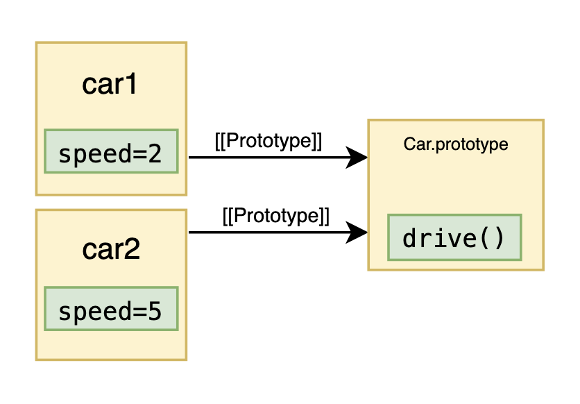

# Chapter 7 - Constructors


Constructors provide a convenient way to create instances of Objects. Below we use the `Date` constructor to create a new date Object.

```jsx
const obj = new Date()
console.log(typeof obj) // object
```

# What is a constructor?

All functions in JavaScript have an internal method called [[Call]]. This method is used to execute the code inside the function. Some JavaScript functions have another internal method called [[Construct]]. It too, executes the code in the function, although slightly differently. Functions that have a [[Construct]] method are called constructors.

### new

But how do you call a function using [[Construct]] instead of [[Call]]? You use the `new` operator. We can see this with the `Date` constructor. Below, we call it in two ways. The first is with the `new` operator and the second is without. Both ways work.

```jsx
const obj1 = new Date() // Internally calling [[Construct]]
const obj2 = Date() // Internally calling [[Call]]
```

### Reflect.construct

Another way to call a constructor using [[Construct]] is with `Reflect.construct`. The first argument is the constructor and the second is an array of arguments.

```jsx
const obj = Reflect.construct(Date, [])
console.log(typeof obj) // object
```

>💡 There is a third optional argument for `Reflect.construct` called `newTarget`. It is only relevant for classes and will be covered later.
>


# Which functions have a [[Construct]] method?

Some functions have an internal [[Construct] method and some don’t. You will now see some examples of constructors and non-constructors.

>⚠️ If you attempt to call [[Construct]] on a non-constructor function it will throw a `TypeError`.
>

### Classes

Classes are a common way to create instances of Objects. They are constructors. Much more on them later.

```jsx
class Func {}
new Func() // OK
```

### Traditional functions

Generally speaking, traditional functions are valid constructors. This might be surprising if you’re mainly using classes.

```jsx
function Func() {}
new Func() // OK
```

An exception to this are async functions. They are not constructors.

```jsx
async function Func() {}
new Func() // TypeError: Not a constructor
```

### Arrow functions

Arrow functions are not constructors.

```jsx
const Func = () => {}
new Func() // TypeError: Not a constructor
```

# [[Construct]]

What exactly does [[Construct]] do when called on a function? Here is a brief overview:

1. Create an empty Object
2. Set its prototype to the value of the constructor’s `prototype` property
3. Execute the code with `this` being a reference to the Object
4. Return the Object

Step 2 and 3 will be covered further below.

### The prototype property

All constructors will have a property called `prototype`. Below, we define a constructor called `Car` and verify that it has a `prototype` property. As we can see, the type is an Object.

```jsx
function Car() {
console.log(typeof Car.prototype) // object
```

Given the name of the property, it’s easy to think that it references the prototype of the *constructor*. That’s wrong.

```jsx
function Car() {}
const CarProto = Reflect.getPrototypeOf(Car)
console.log(CarProto === Car.prototype) // false
```

The `prototype` property actually holds the prototype that the constructor wishes to give *instances* created with it.

```jsx
function Car() {}
const instance = new Car()
const instanceProto = Reflect.getPrototypeOf(instance)
console.log(instanceProto === Car.prototype) // true
```

### The this inside a constructor

Consider this function:

```jsx
function Car(speed) {
  this.speed = speed
}
```

It assigns a property to its `this` and then ends. Calling the function using [[Construct]] will execute the code inside and return its `this` to us. 

```jsx
function Car(speed) {
  this.speed = speed
}

console.log(new Car(5)) // { speed: 5 }
```

As we can see, the return value we get from invoking [[Construct]] (using `new`) is an Object with a `speed` property. Meaning, the “instance” we receive from a constructor is actually an instance of its `this`.

### Putting this and prototype together (creating methods)

Turns out, the `prototype` property of a constructor is the perfect place to define methods for its instances. Consider the `Car` constructor from before. Let’s give it a method called `drive`.

```jsx
function Car(speed) {
  this.speed = speed
}

Car.prototype = {
  drive() {
    console.log(`Wr${"o".repeat(this.speed)}m!`)
  }
}

const car1 = new Car(2)
car1.drive() // Wroom!
const car2 = new Car(5)
car2.drive() // Wrooooom!
```

Above, two instances being created, `car1` and `car2`. As we can see, they are both able to access the `drive` method defined on `Car.prototype`.



This is a common pattern when giving methods to JavaScript instances. The two instances don’t have a `drive` method each. Instead, they *share* the `drive` method by both having `Car.prototype` as their prototype.

>💡 You might be wondering why the result of calling `drive` on the instances is different. After all, they access the exact same method. The difference comes from the `this` inside the drive method.
>`drive` is a traditional function so its `this` is the Object its called *on*. That explains the difference between calling `car1.drive()` and `car2.drive()`.
>

# instanceof

The `instanceof` operator tells you if an Object contains a constructor’s `prototype` property somewhere in its prototype chain.

To illustrate this, let’s create a date and visualize its prototype chain.

```jsx
const date = new Date()
```


As we can see, both `Date.prototype` and `Object.prototype` exist in its prototype chain. This means that `instanceof` will return `true` for both `Date` and `Object`.

```jsx
const date = new Date()

console.log(date instanceof Date) // true
console.log(date instanceof Object) // true
```

>💡 In reality, `instanceof` will first check for a method on the constructor using the well-known Symbol key `Symbol.hasInstance`. If such a method exists, `instanceof` will call it and return its result. If it doesn’t exist, `instanceof` will work as described above.
>This essentially means that the result of `instanceof` can be customized for individual constructors. However, constructors rarely take advantage of this.
>
