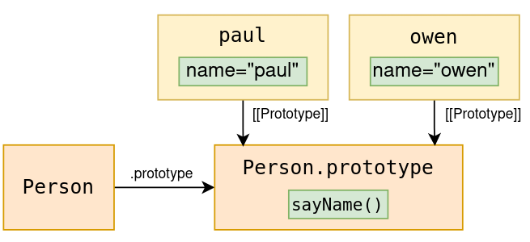

# Chapter 8 - Classes

Classes give you a way to create instances of objects with common functionality. You create them using the `class` keyword. Here is an example of a class:

```js
class Person {
	constructor(name) {
		this.name = name
	}

	sayName() {
    console.log("My name is", this.name)
  }

	static askName() {
		console.log("What is your name?")
	}
}

const paul = new Person("Paul")
Person.askName() // What is your name?
paul.sayName() // My name is Paul
```

Under the hood, classes mainly use concepts covered in the previous chapters. In fact, almost all the functionality classes provide can be implemented without them. This was done for many years before classes were introduced in 2015. Nevertheless, classes make development a lot easier. 

# Classes are constructors

The first thing you need to know about classes is that they are constructors. To clarify, the class *itself* is a constructor. Meaning a class is a *function* with both a [[Call]] and [[Construct]] internal method. However, if you call a class using [[Call]] it will throw a `TypeError`. This means there is practically only one way to call classes, with [[Construct]].

```js
new MyClass() // Internally calling [[Construct]], OK
MyClass() // Internally calling [[Call]], throws TypeError
```

# The special constructor method

A class method called `constructor` will be considered special to classes. To understand it, it helps to remember what a class is. It’s a function. A function, of course, has code inside it. Turns out, the code inside a class comes from its `constructor` method. It sounds strange but bear with me.

Let’s create a class and a traditional function that do the same when called with `new`.

```js
class MyClass {
  constructor() {
    console.log("Hello!")
  }
}

function MyFunc() {
  console.log("Hello!")
}

new MyClass() // Hello!
new MyFunc() // Hello!
```

For the class, isn’t it a bit strange that we executed the `console.log` code by calling `new MyClass()` and didn’t have to call `new MyClass.constructor()`? After all, the `console.log` code exists inside a method inside the class. But this works because the code of the `constructor` method becomes the code of the class function itself.


>⚠️ A class definition doesn’t actually produce a traditional function definition like shown above. Both definitions create their own internal function Object. However, it’s safe to assume, for now, that they produce an identical function Object. Meaning, you can use the above figure as a helpful mental model.
>

>💡 It’s not required to define a `constructor` method. If you don’t, it’s the equivalent of defining an empty one (`constructor(){}`).
>
>This doesn’t apply to *derived classes* which will be covered later.
>

# Own properties

Certain properties will be own properties of objects created with classes. Meaning, the properties will exist *on* the instance. Not in its prototype chain or anywhere else.

Classes have two ways to give their instances own properties:

- Instance properties
- Field declarations

### Instance properties

Instance properties are defined inside the special `constructor` class method we covered above. You define them by assigning properties to `this`.  

```jsx
class Person {
  constructor(name) {
    this.name = name
  }
}

const paul = new Person("Paul")
console.log(paul) // { name: "Paul" }
```

Above, we have a class called `Person` that has a `constructor` method which assigns a value to `this.name`.̣ When we invoke [[Construct]] on the class (using `new`) we get an object with our instance property, `name`.

We can mimic this with a traditional function:

```js
function Person(name) {
  this.name = name
}

const paul = new Person("Paul")
console.log(paul) // { name: "Paul" }
```

### Field declarations

Field declarations are another way to define own properties on class instances. They are defined in the body of a class (outside any method).

```js
class Cat {
  livesLeft = 9
}

const garfield = new Cat()
console.log(garfield) // { livesLeft: 9 }
```

# Methods

>💡 This covers non-static methods.
>

Defining a method on a class will actually define it on the classes `.prototype` property. Remember, a class is a constructor, and the `.prototype` property is special to constructors. The prototype of instances created with a constructor, will come from the *constructors* `.prototype` property. To illustrate this, let’s create two instances from a class with a `sayName` method. 

```js
class Person {
  constructor(name) {
    this.name = name
  }
  sayName() {
    console.log("My name is", this.name)
  }
}

const paul = new Person("Paul")
const owen = new Person("Owen")

paul.sayName() // My name is Paul
owen.sayName() // My name is Owen
```

At first glance, it seems like `paul` and `owen` each have their own `sayName` method. But in reality, they both share the exact same method.

```js
console.log(paul.sayName === owen.sayName) // true
```

This is because they both inherited the method from their prototype. Since `paul` and `owen` where created as instances of a constructor, their prototype comes from the constructor’s `.prototype` property. In this case the constructor is `Person`.

```jsx
const paulProto = Reflect.getPrototypeOf(paul)
const owenProto = Reflect.getPrototypeOf(owen)
console.log(paulProto === Person.prototype) // true
console.log(owenProto === Person.prototype) // true
```

Below is an illustration of how `paul` and `owen` access the `sayName` method.



# Static members

Static members, that is, static field declarations and methods, exists as own properties of the class *itself*. They do not appear in the prototype chain of instances, and they can only be accessed directly on the class.

```js
class Person {
  static totalPeople = 0
  static incrementPeople() {
    Person.totalPeople += 1
  }
}

Person.incrementPeople()
console.log(Person.totalPeople) // 1
```

Above we have a class with two static members, `totalPeople` and `incrementPeople`. We access these members directly on `Person`.

# Derived classes

Classes can inherit functionality from other classes using the `extends` keyword. A class that “extends” another class is called a *derived class*. Setting up this inheritance will add another link in the prototype chain of class instances. Specifically, the object stored on the `.prototype` property of a derived class will have a prototype pointing to the `.prototype` property of the parent class.

To explore this, let’s create a derived class called `Cat` that derives from `Animal`. We can then create an instance called `cat` and examine its prototype chain.

```js
class Animal {}
class Cat extends Animal {}

const cat = new Cat()
```


As we can see, the prototype of `Cat.prototype` is `Animal.prototype`. This means that properties defined on `Animal.prototype` are available to our instance `cat` through prototype chain inheritance. We can see this by defining a `sayHi` method on `Animal`.

```js
class Animal {
  sayHi() {
    console.log("Hi! I'm an animal")
  }
}

class Cat extends Animal {}

const cat = new Cat()

cat.sayHi() // Hi! I'm an animal
```

Above, we can see that `sayHi` is available to our `cat` instance. It’s inherited from `Animal.prototype`.

```js
console.log(cat.sayHi === Animal.prototype.sayHi) // true
```

### Super keyword

The `super` keyword allows a derived class to interact with its parent.

#### this of a super call

Calling `super` inside the `constructor` method of a derived class calls [[Construct]] on the parent class. When this happens, the `this` inside both functions is the same object. This can be seen in the below demonstration.

```js
let this1
let this2

class Parent {
  constructor() {
    this1 = this
  }
}

class Derived extends Parent {
  constructor() {
    super()
    this2 = this
  }
}

new Derived()
console.log(this1 === this2) // true
```

This means that any assignment to `this` inside the parent class' `constructor` method also happens to `this` inside the derived class’ `constructor` method. We can see this below where we define a message on `this.hello` inside the parent class `Parent`. The message is then available on the `this` inside `Derived` after we call `super`.

```js
class Parent {
  constructor() {
    this.hello = "Hello from Parent"
  }
}

class Derived extends Parent {
  constructor() {
    super()
    console.log(this.hello) // Hello from Parent
  }
}

new Derived()
```

>⚠️ Any use of `this` before calling `super` inside a derived class will result in a `ReferenceError`.
>

#### Arguments of a super call

The arguments to a `super` call becomes the arguments used when [[Construct]] is called on the parent class.

```js
class Calculator {
  constructor(num1, num2) {
    this.result = num1 + num2
  }
}

class Derived extends Calculator {
  constructor() {
    super(2, 6)
    console.log(this.result) // 8
  }
}

new Derived()
```

>💡 If you don’t define a `constructor` method inside a derived class, it’s the equivalent of defining one that calls `super` with all its own arguments (`constructor(...args) { super(...args) }`)
>

#### Accessing a property on super

Accessing a property on `super` will go up the prototype chain starting with the classes *parent*. This makes it useful if a method with the same name is defined in both a derived- and parent class. We can see this below where we access `method` on both `this` and `super` with different results.

```js
class Parent {
  method() {
    console.log("You accessed Parent")
  }
}

class Derived extends Parent {
  constructor() {
    super()
    this.method()  // You accessed Derived
    super.method() // You accessed Parent
  }
  method() {
    console.log("You accessed Derived")
  }
}

new Derived()
```

# Private members

Private members are exclusive to classes. They allow you to define properties and methods which are inaccessible outside their class. A private class member is prefixed with a hashtag (`#`).

>💡 Private members won’t become part of the classes prototype chain inheritance. Meaning, they can’t be inherited by derived classes.
>


### Private field

```js
class Person {
  #age = 0
  constructor(age) {
    this.#age = age
  }
}

const person = new Person(30);
person.#age // syntaxError
```

As we can see, `#age` is not accessible outside the class.

>💡 Private properties have to be declared as fields. Meaning, they have to be declared in the body of the class (outside any method). This is unlike public properties which can be declared directly on `this` without first being declared as a field.
>

### Private method

Like private fields, it’s also possible to define private methods.

```js
class Person {
  #age = 0
  constructor(age) {
    this.#age = age
  }
  #canVote() {
    return this.#age >= 18
  }
}

const person = new Person(30)
person.#canVote() // syntaxError
```

### Private static members

It’s also possible to define private static members. These fields and methods, while static, are only accessible inside the scope of the class they are defined within.

```js
class Person {
  constructor() {
    Person.#incrementPeople()
  }
  static #totalPeople = 0
  static #incrementPeople() {
    Person.#totalPeople += 1
  }
}

Person.#incrementPeople() // SyntaxError
Person.#totalPeople // SyntaxError
```
